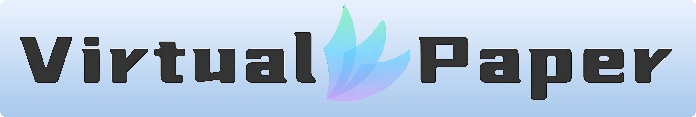
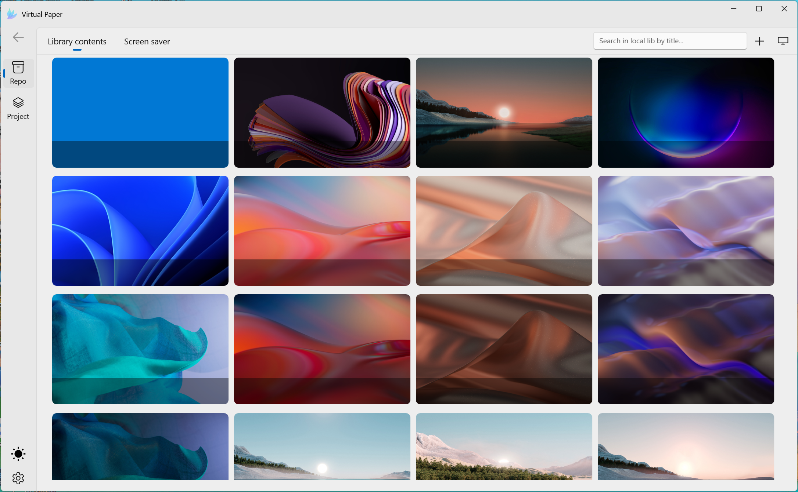
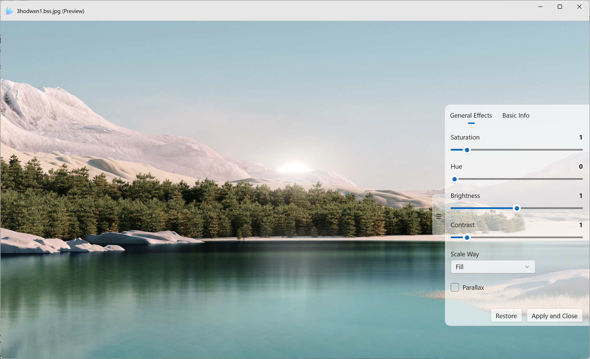
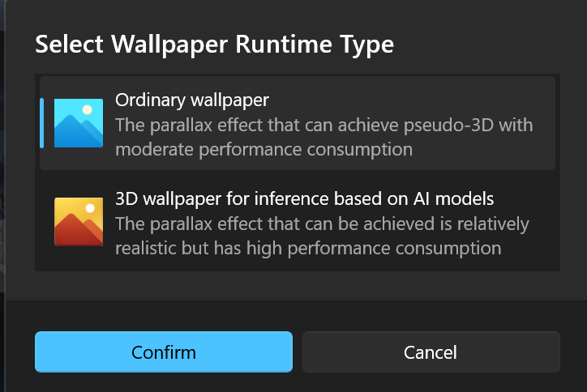
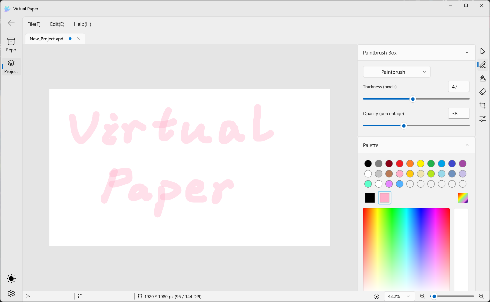
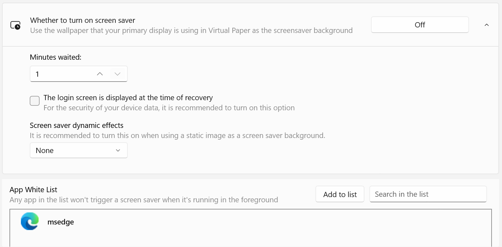
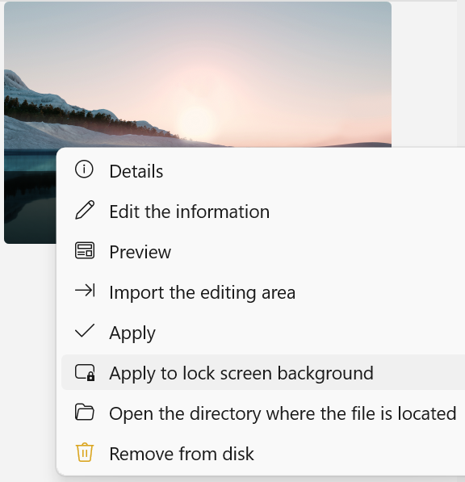
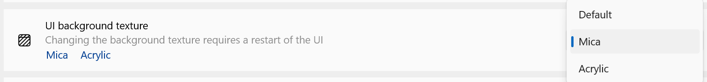
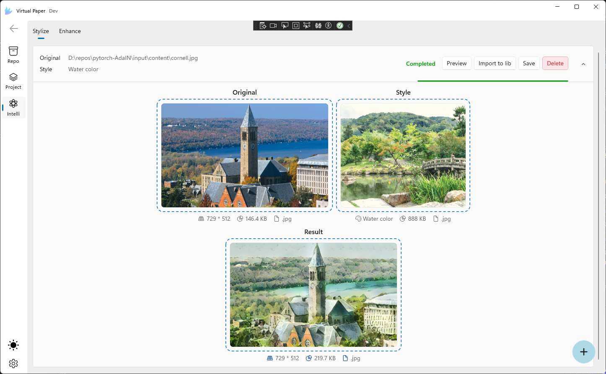
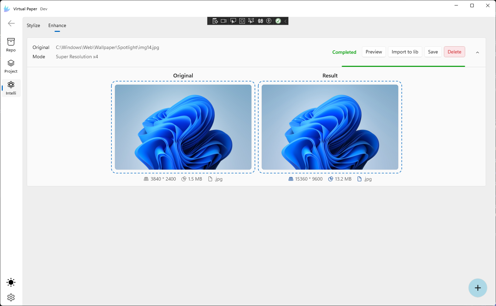

# VirtualPaper

An open-source, free, lightweight wallpaper management software for Windows 10+

> **Runtime requirement:** .NET 8.0

---

## Contents

- [About](#about)
- [Features](#features)
- [AI+](#ai)
- [Download](#download)
- [Support](#support)
- [License](#license)

---

## About

Built on top of [XamlNexus](https://github.com/PaperHammer/XamlNexus) and [Lively](https://github.com/rocksdanister/lively).

---

## Features

**Supported file types**

| Wallpaper Type  | Extensions                                          |
| --------------- | --------------------------------------------------- |
| Still Image     | `.jpg` `.jpeg` `.bmp` `.png` `.svg` `.webp`         |
| Motion Picture  | `.gif` `.apng`                                      |
| Video           | `.mp4` `.webm`                                      |
| Web Interactive | `.zip` `.rar` `.7z`                                 |

---

**Real-time preview & effect customization**

---

**3D parallax — follows your mouse**

---

**Efficient lightweight rendering**

Supports exporting: PNG, BMP, JPEG, JPEG XR

---

**Independent screen saver**

Screen saver service that does not rely on Windows built-in support.

---

**Lock screen background**

Quickly set the lock screen background image.

---

**Modern theme styles**

---

## AI+

**Image Style Transfer**

Transfer the artistic style of a reference image onto your wallpaper using AI.

---

**Super Resolution**

AI-powered image enhancement:

- **Clarity Restoration** — sharpen blurry or low-quality images
- **Lossless Upscaling** — increase resolution without losing detail

---

## Download

Requires **Windows 10 (10.0.19041.0)** or above.

##### [→ Download latest installer](https://github.com/PaperHammer/VirtualPaper/releases/latest)

---

## Support

**Localization**

Found a translation error, or want to add a new language?
[Submit a localization issue →](https://github.com/PaperHammer/VirtualPaper/issues/new?assignees=&labels=Issue-Bug%2CArea-Localization%2CIssue-Translation%2CNeeds-Triage&projects=&template=translation_issue.yml)

**Suggestions & Bug Reports**

Have a feature idea or found a bug?
[Open an issue →](https://github.com/PaperHammer/VirtualPaper/issues/new?assignees=&labels=Issue-Bug%2CNeeds-Triage&projects=&template=bug_report.yml)

---

## License

VirtualPaper is licensed under [GPL-3.0](https://github.com/PaperHammer/VirtualPaper/blob/main/LICENSE).
