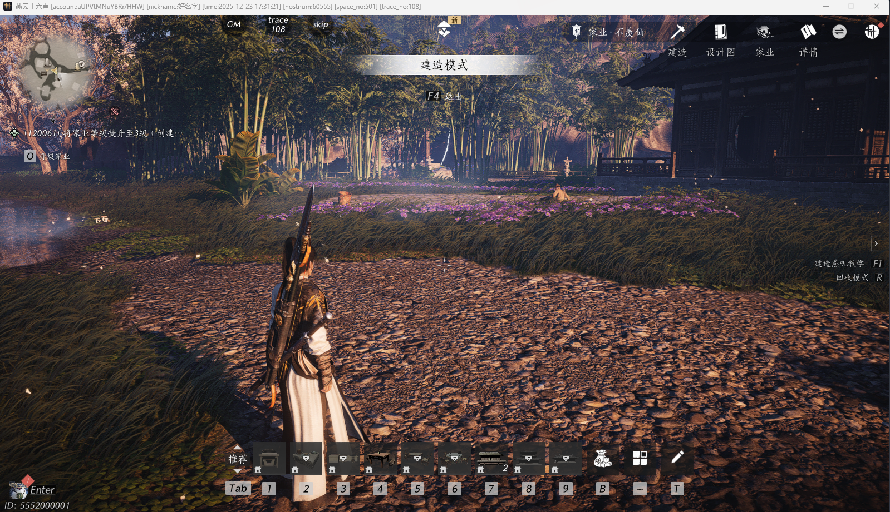

# Markdown Preview Test

This file is added temporarily for checking the WebEditor Markdown split view.

## Image



## Checklist

- Left side shows raw Markdown
- Right side shows rendered preview
- Code block renders correctly

```js
console.log('markdown preview');
```
